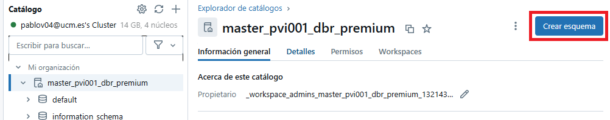
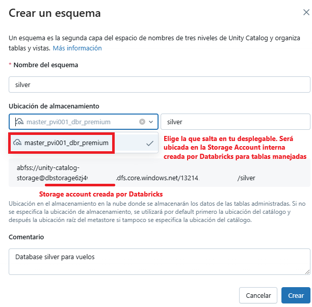

# spark-ejercicios
Paquete de Python con ejercicios de ETL para practicar 

## Primera semana: lectura de datos crudos, preprocesamiento y guardado a fichero

En esta primera semana, escribiremos el código para preprocesar los datos en crudo y obtener datos más utiles y de 
mejor calidad, aunque los guardaremos provisionalmente en otro fichero. El procesamiento será mejorado en la segunda 
semana, para que el destino de los datos transformados sean tablas de Databricks en lugar de un fichero. 

* Modificar en el fichero JSON de configuración la propiedad `raw_input_file` que contiene la ruta del fichero CSV 
de vuelos, para adecuarse al nombre de tu contenedor de ADLS.
* Modificar también `DATABRICKS_PROFILE` para adecuarlo al perfil que hayas puesto en tu fichero `.databrickscfg` 

## Segunda semana: creación de databases y guardado en bronze y silver

* En Databricks, mediante interfaz gráfica, crear las databases `bronze` y `silver`.
  * En realidad, bronze y silver podrían ser catálogos completos, en los cuales las databases se crearían según dominios de negocio,
  tales como productos, clientes, reclamaciones, etc, donde cada database agruparía distintas tablas de ese dominio funcional.
  Aquí para simplificar, usaremos un sólo catálogo (el que ya viene creado con el mismo nombre de la instancia de Databricks)
  y crearemos databases para los niveles de calidad del dato (bronze, silver, gold), en lugar de crear catálogos de bronze, silver y gold.
* Modificar el fichero JSON de configuración con los valores adecuados para el destino de las tablas, y la fecha de procesamiento.
  * En caso de estar en blanco, generalmente indicaría algo como *procesar los datos de ayer*, pero aquí significará 
  procesar los datos completos.
  
* Leer el fichero de vuelos, que debe estar situado en la ruta de ADLS indicada en el json, y solo para la fecha indicada en el JSON.

#### Instrucciones para crear databases en Databricks

